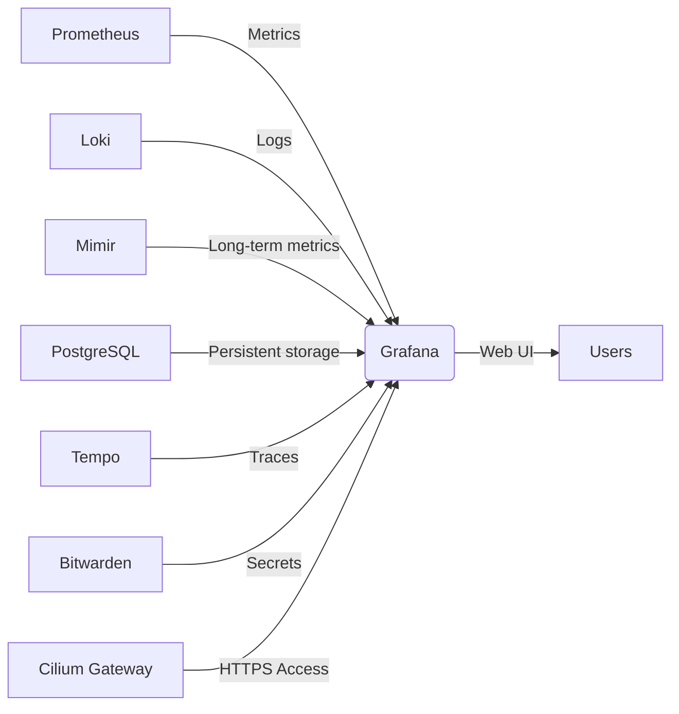

# Grafana Enterprise Dashboard Platform

- [Grafana Enterprise Dashboard Platform](#grafana-enterprise-dashboard-platform)
  - [Зачем нужен этот компонент](#зачем-нужен-этот-компонент)
  - [Архитектура](#архитектура)
  - [Особенности реализации](#особенности-реализации)
    - [1. Multi-кластерное развертывание](#1-multi-кластерное-развертывание)
    - [2. Отказоустойчивая база данных](#2-отказоустойчивая-база-данных)
    - [3. Безопасность](#3-безопасность)
    - [4. Сетевой доступ](#4-сетевой-доступ)
    - [5. Отказоустойчивость Grafana](#5-отказоустойчивость-grafana)
  - [Зависимости](#зависимости)
  - [Интеграция с экосистемой](#интеграция-с-экосистемой)
    - [1. Источники данных](#1-источники-данных)
    - [2. Аутентификация](#2-аутентификация)
    - [3. Хранилище конфигураций](#3-хранилище-конфигураций)
  - [Production-рекомендации](#production-рекомендации)

## Зачем нужен этот компонент

Grafana Enterprise Dashboard Platform предоставляет **единый интерфейс визуализации** для всех метрик, логов и трейсов в Kubernetes-инфраструктуре, решающий ключевые проблемы:

- 📊 Централизованная панель управления для мониторинга всех кластеров и приложений
- 🔗 Интеграция данных из разных источников (Prometheus, Loki, Tempo, PostgreSQL) в едином интерфейсе
- 👥 Мульти-тенантность с изоляцией дашбордов и данных для разных команд
- 💾 Персистентное хранение конфигураций и дашбордов в PostgreSQL вместо ConfigMap
- 🔐 Enterprise-безопасность с интеграцией в корпоративные системы аутентификации

**Проблемы, которые решает:**

- Отсутствие единого интерфейса для анализа метрик, логов и трейсов
- Потеря дашбордов при перезапуске Grafana при использовании ConfigMap
- Сложность управления доступом к дашбордам для разных команд
- Отсутствие версионирования конфигураций дашбордов

## Архитектура



## Особенности реализации

### 1. Multi-кластерное развертывание

```yaml
targetCustomizations:
  - name: aggregator
    clusterSelector:
      matchLabels:
        okbtsp.corp/monitoring-aggregator: "true"
    kustomize:
      dir: "full"
  - name: namespace-only-placeholder
    clusterSelector:
      matchLabels:
        okbtsp.corp/department: OIT
    kustomize:
      dir: "base"
```

- **Полная установка** только в агрегаторных кластерах с ролью `monitoring-aggregator`
- **Только namespace** во всех остальных кластерах
- Централизованное управление через GitOps подход

### 2. Отказоустойчивая база данных

```yaml
apiVersion: pgv2.percona.com/v2
kind: PerconaPGCluster
metadata:
  name: grafana-pg
spec:
  instances:
    - name: instance1
      replicas: 3
      dataVolumeClaimSpec:
        storageClassName: "vsphere-csi"
        resources:
          requests:
            storage: 1Gi
```

- 3 реплики PostgreSQL для отказоустойчивости
- pgBouncer для управления подключениями
- Автоматические бэкапы в MinIO с шифрованием
- Использование VMware CSI для персистентного хранения

### 3. Безопасность

```yaml
apiVersion: external-secrets.io/v1
kind: ExternalSecret
metadata:
  name: grafana-secret
spec:
  secretStoreRef:
    name: bitwarden-secretsmanager
  dataFrom:
    - extract:
        key: percona-grafana-credentials
    - extract:
        key: grafana-password
```

- Все секреты хранятся в Bitwarden, а не в Git
- Автоматическая синхронизация через External Secrets Operator
- PushSecret для сохранения сгенерированных паролей обратно в Bitwarden
- Корпоративный CA для доверия внутренним сертификатам

### 4. Сетевой доступ

```yaml
apiVersion: gateway.networking.k8s.io/v1
kind: HTTPRoute
metadata:
  name: grafana-route
spec:
  parentRefs:
    - name: shared-gateway
      namespace: cilium-gateway
      sectionName: https-corp
  hostnames:
    - "grafana.okbtsp.corp"
```

- Доступ через единый endpoint `grafana.okbtsp.corp`
- TLS termination на уровне Cilium Gateway
- Поддержка двух доменов для учебных целей (`.com` и `.corp`)

### 5. Отказоустойчивость Grafana

```yaml
spec:
  replicas: 3
  affinity:
    nodeAffinity:
      requiredDuringSchedulingIgnoredDuringExecution:
        nodeSelectorTerms:
          - matchExpressions:
              - key: node-role.kubernetes.io/infra
                operator: In
                values: [""]
  tolerations:
    - key: "node-role.kubernetes.io/infra"
      operator: "Equal"
      value: ""
      effect: "NoSchedule"
```

- 3 реплики Grafana с anti-affinity
- Размещение только на выделенных infra-нодах
- Health checks для автоматического восстановления
- Отделение хранения (`emptyDir`) от приложения для быстрого восстановления

## Зависимости

```yaml
dependsOn:
  - selector:
      matchLabels:
        okbtsp.corp/project: external-secrets
  - name: prom-operator
  - name: postgres-operator
```

- **External Secrets Operator** для управления секретами
- **Prometheus Operator** для сбора метрик Grafana
- **Percona PostgreSQL Operator** для развертывания БД

## Интеграция с экосистемой

### 1. Источники данных

- **Prometheus** - основные метрики кластера
- **Mimir** - долгосрочное хранение метрик
- **Loki** - логи приложений и системные логи
- **PostgreSQL** - хранение конфигураций Grafana
- **Bitwarden** - управление секретами

### 2. Аутентификация

```yaml
env:
  - name: GF_USERS_ALLOW_SIGN_UP
    value: "false"
  - name: GF_USERS_AUTO_ASSIGN_ORG
    value: "true"
```

- Отключена самостоятельная регистрация пользователей
- Автоматическое назначение организации при входе
- Интеграция с корпоративной системой SSO

### 3. Хранилище конфигураций

```yaml
env:
  - name: GF_DATABASE_TYPE
    value: "postgres"
  - name: GF_DATABASE_HOST
    valueFrom:
      secretKeyRef:
        name: grafana-secret
        key: POSTGRES_HOST
```

- Хранение конфигураций в PostgreSQL вместо ConfigMap
- Возможность версионирования дашбордов
- Сохранение настроек пользователей между перезапусками

## Production-рекомендации

1. **Хранилище**:

   - Замените `emptyDir` на персистентное хранилище для production
   - Увеличьте размер PVC для PostgreSQL до 50-100Gi для больших инсталляций

2. **Безопасность**:

   ```yaml
   env:
     - name: GF_AUTH_GENERIC_OAUTH_ENABLED
       value: "true"
     - name: GF_AUTH_GENERIC_OAUTH_CLIENT_ID
       valueFrom:
         secretKeyRef: { name: oauth-secrets, key: client_id }
   ```

   - Интеграция с корпоративной OIDC-системой
   - Настройка RBAC на уровне дашбордов
   - Регулярная аудиторская проверка доступов

3. **Производительность**:

   - Для кластеров с > 1000 дашбордов увеличьте ресурсы до 4 CPU/8Gi RAM
   - Настройте кэширование запросов к базам данных
   - Используйте отдельные инстансы Grafana для разных команд

4. **Резервное копирование**:
   - Регулярно экспортируйте дашборды в Git
   - Настройте point-in-time recovery для PostgreSQL
   - Тестируйте восстановление из бэкапов ежеквартально

> **Важно:** Для production-сред никогда не используйте admin-учетную запись для повседневной работы. Настройте отдельные сервисные аккаунты с минимальными необходимыми привилегиями. Всегда включайте аудит логов Grafana и настраивайте алертинг на подозрительную активность. Для критически важных дашбордов настройте автоматическое тестирование работоспособности.
